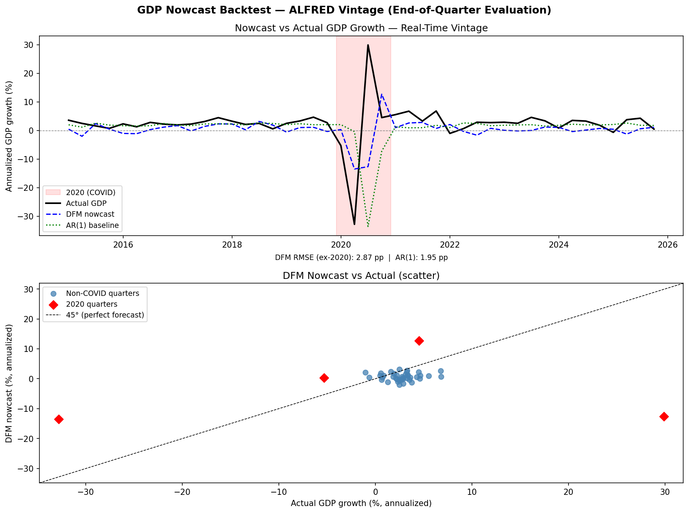
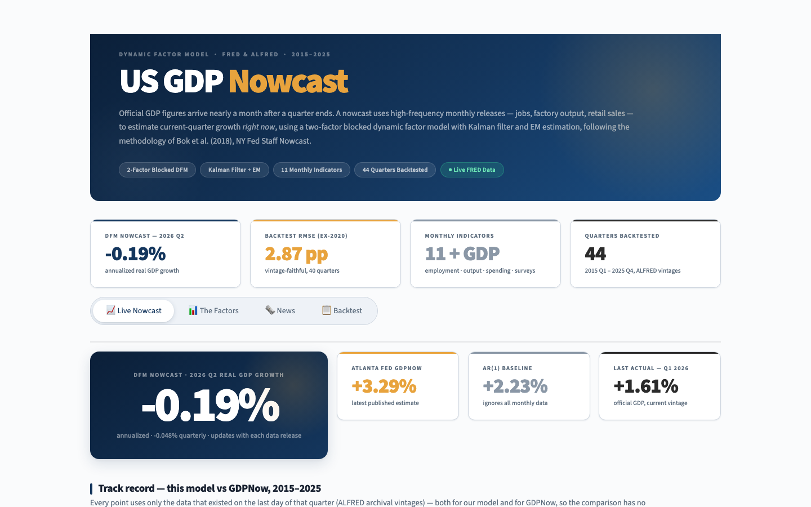
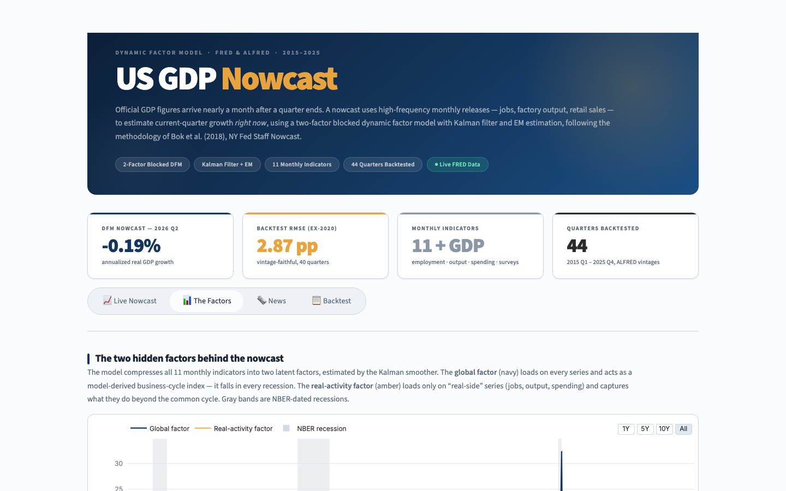
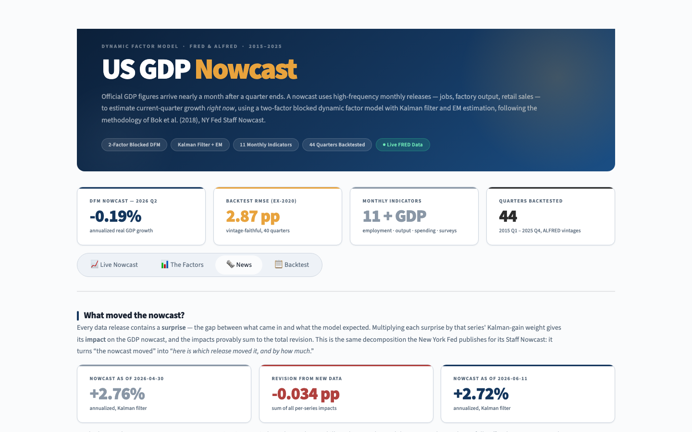
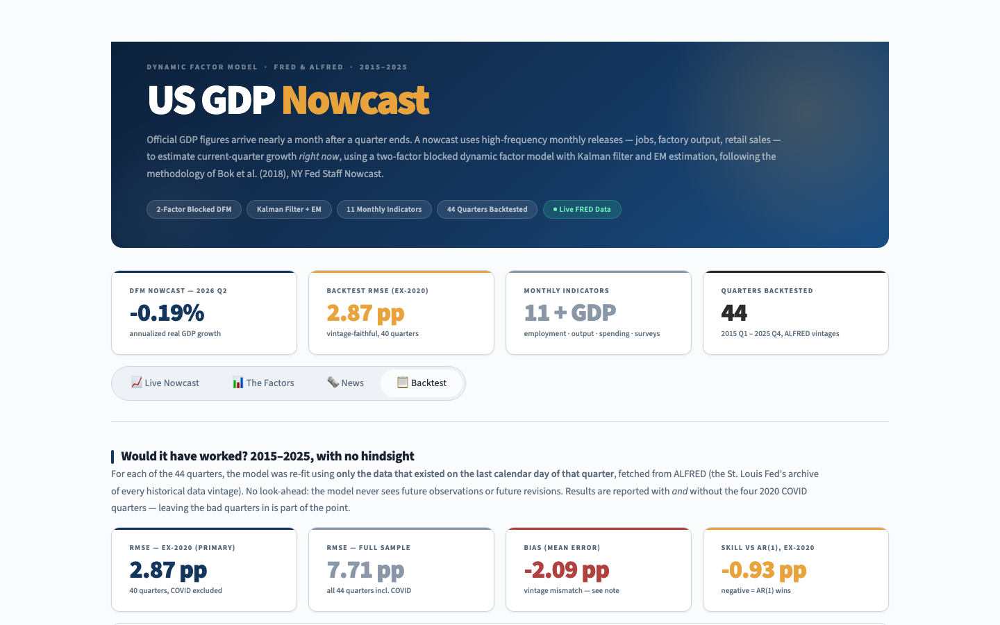

# Nowcasting US GDP with a Mixed-Frequency Dynamic Factor Model

**🔗 Live dashboard:** _<!-- TODO: paste Streamlit Community Cloud URL here after deploy -->_ `https://<your-app>.streamlit.app`

A real-time estimate of current-quarter US real GDP growth, built with a
mixed-frequency dynamic factor model (DFM) estimated by Kalman filter and the
EM algorithm — the methodology behind the [New York Fed Staff Nowcast](https://www.newyorkfed.org/research/policy/nowcast).
The model is implemented with `statsmodels`' `DynamicFactorMQ`, backtested
against real-time data vintages from ALFRED, and benchmarked against the
Atlanta Fed's GDPNow and a naïve AR(1).

---

## Abstract

Official GDP is published with a lag of nearly a month after a quarter ends,
yet dozens of monthly indicators — payrolls, industrial production, retail
sales, regional Fed surveys — arrive continuously throughout the quarter. A
*nowcast* exploits these higher-frequency releases to estimate GDP growth for
the quarter currently in progress. This project implements a two-factor blocked
dynamic factor model on 11 monthly US indicators plus quarterly real GDP,
following Bok, Caratelli, Giannone, Sbordone & Tambalotti (2018). The model
handles mixed sampling frequencies and ragged-edge data (series that end on
different dates) within a state-space framework, estimates the latent factors
with the Kalman filter and smoother, fits parameters via the EM algorithm, and
decomposes each nowcast revision into the contribution of individual data
releases ("the news"). Evaluated out-of-sample on 44 quarters (2015 Q1 – 2025
Q4) using strictly vintage-faithful ALFRED data — so the model never sees a
number that did not exist at the time — the two-factor model achieves a
real-time RMSE of **2.87 annualized percentage points excluding 2020**. A naïve
AR(1) edges it (1.95 pp) in calm periods, which is expected for an 11-series
model versus the NY Fed's 127, but the DFM's value lies in turbulent periods
and in its interpretability: it yields latent business-cycle factors and a
release-by-release decomposition that no univariate baseline can provide.

---

## 1. Methodology

### 1.1 The dynamic factor model

The core idea is that a handful of unobserved (latent) factors drive the
co-movement of many observed economic series. Let $x_t$ be the $n \times 1$
vector of (stationary-transformed, standardized) indicators at month $t$. Each
series is modeled as a linear combination of $r$ common factors $f_t$ plus an
idiosyncratic component $e_{i,t}$:

$$
x_{i,t} = \lambda_i' f_t + e_{i,t}, \qquad i = 1, \dots, n
$$

where $\lambda_i$ is the $r \times 1$ vector of **factor loadings** for series
$i$. The factors follow a vector autoregression (the **transition equation**):

$$
f_t = A_1 f_{t-1} + \dots + A_p f_{t-p} + u_t, \qquad u_t \sim N(0, Q)
$$

and each idiosyncratic term follows its own AR(1), $e_{i,t} = \rho_i e_{i,t-1}
+ \varepsilon_{i,t}$, which absorbs series-specific dynamics so they don't
contaminate the common factors. Together the measurement and transition
equations form a linear Gaussian **state-space model**.

This project uses a **blocked** two-factor specification:

- a **global factor** that loads on all 11 indicators and behaves as a
  model-derived business-cycle index (it falls in every NBER recession);
- a **real-activity factor** that loads only on the "real-side" series (jobs,
  output, consumption, orders, income), capturing what they share *beyond* the
  common cycle.

The blocked structure (LLF −3510) materially out-fits a single global factor
(LLF −3682) in-sample.

### 1.2 Mixed frequency and the ragged edge

GDP is quarterly; the indicators are monthly; and at any given moment the most
recent month is available for some series but not others (the "ragged edge").
The state-space form handles all of this naturally. Following Mariano & Murasawa
(2003), a quarterly variable is treated as a monthly variable observed only
every third month, linked to its unobserved monthly counterpart by a fixed
aggregation rule. Missing observations — whether from frequency mismatch or the
ragged edge — are simply skipped in the Kalman recursions; the filter projects
through them using the model dynamics. This is exactly why a partially-observed
current quarter can still be nowcast: the missing GDP value is just another
state the filter infers from the monthly data that *has* arrived.

### 1.3 Estimation: Kalman filter, smoother, and EM

Given parameters $\theta = \{\Lambda, A, Q, \rho, \dots\}$, the **Kalman filter**
computes the optimal (minimum-MSE) estimate of the latent factors conditional
on data up to time $t$, $\mathbb{E}[f_t \mid x_{1:t}]$, by recursively
alternating a *prediction* step and an *update* step that corrects the
prediction by the forecast error (the "innovation") weighted by the Kalman
gain. The **Kalman smoother** then runs backward to condition on the *full*
sample, $\mathbb{E}[f_t \mid x_{1:T}]$ — this is what the dashboard plots as the
factors.

The parameters themselves are unknown, so they are estimated by the
**Expectation–Maximization (EM)** algorithm, which is well suited to latent-
variable models with missing data:

- **E-step:** with $\theta$ fixed, run the Kalman smoother to compute the
  expected complete-data log-likelihood (i.e., infer the factors).
- **M-step:** with the inferred factors fixed, update $\theta$ by closed-form
  regressions that maximize that likelihood.

Iterating drives the log-likelihood monotonically upward to a (local) maximum.
We do **not** hand-roll any of this — both the Kalman recursions and the EM
loop are provided by `statsmodels.tsa.statespace.DynamicFactorMQ`, which
implements precisely the Bok et al. (2018) framework.

### 1.4 News decomposition

When new data is released, the nowcast changes. The **news decomposition**
attributes that change to individual releases. The revision in the nowcast of
target variable $y$ between an old and a new data vintage is

$$
\underbrace{\hat{y}_{\text{new}} - \hat{y}_{\text{old}}}_{\text{revision}}
= \sum_{j} \, w_j \underbrace{\left(x_j - \mathbb{E}[x_j \mid \text{old data}]\right)}_{\text{news (surprise)}}
$$

Each newly observed value $x_j$ contains a **surprise** — the gap between what
was released and what the model expected given the old information set. The
surprise is multiplied by a Kalman-gain-derived **weight** $w_j$ to give that
release's **impact** on the nowcast. The impacts provably sum to the total
revision (verified in `tests/test_news.py` to a tolerance of $10^{-5}$). This is
the same decomposition the NY Fed publishes each week, turning "the nowcast
moved" into "*here is which release moved it, and by how much*."

> **Reference.** Bok, B., Caratelli, D., Giannone, D., Sbordone, A. M., &
> Tambalotti, A. (2018). *Macroeconomic Nowcasting and Forecasting with Big
> Data.* Federal Reserve Bank of New York Staff Report No. 830.
> [Link](https://www.newyorkfed.org/research/staff_reports/sr830). Mixed-
> frequency aggregation follows Mariano, R. S., & Murasawa, Y. (2003),
> *A New Coincident Index of Business Cycles Based on Monthly and Quarterly
> Series*, Journal of Applied Econometrics, 18(4).

---

## 2. Data

All data is pulled from [FRED](https://fred.stlouisfed.org) (current values) and
[ALFRED](https://alfred.stlouisfed.org) (historical vintages) via the
`fredapi` client. The panel is 11 monthly indicators spanning output, the labor
market, consumption, housing, orders, income, prices, and regional Fed surveys,
plus quarterly real GDP as the target.

| FRED ID | Series | Freq | Transform | Group |
|---|---|---|---|---|
| `GDPC1` | Real GDP (chained 2017 $) | Q | log-difference | **Target** |
| `INDPRO` | Industrial Production Index | M | log-difference | Output |
| `PAYEMS` | Nonfarm Payroll Employment | M | log-difference | Labor |
| `UNRATE` | Unemployment Rate | M | first difference | Labor |
| `PCEC96` | Real Personal Consumption Expenditures | M | log-difference | Consumption |
| `RSAFS` | Advance Retail & Food Services Sales | M | log-difference | Consumption |
| `HOUST` | Housing Starts | M | log-difference | Housing |
| `DGORDER` | Durable Goods New Orders | M | log-difference | Orders |
| `DSPIC96` | Real Disposable Personal Income | M | log-difference | Income |
| `CPIAUCSL` | CPI, All Urban Consumers | M | log-difference | Prices |
| `GACDISA066MSFRBNY` | NY Fed Empire State Survey (general conditions) | M | level | Survey |
| `GACDFSA066MSFRBPHI` | Philly Fed Business Outlook (general activity) | M | level | Survey |

Each series is transformed to stationarity before estimation (log-differences
for trending levels ≈ growth rates; first differences for the unemployment
rate, already in percent; survey diffusion indices used in levels) and then
standardized.

> **A note on ISM/PMI.** The widely-used ISM Manufacturing PMI (FRED `NAPM*`)
> was **removed from FRED in 2014** for licensing reasons. The NY Fed (Empire
> State) and Philadelphia Fed (Business Outlook) regional survey diffusion
> indices are used as freely-available substitutes.

### 2.1 Avoiding look-ahead bias with ALFRED vintages

The central discipline of an honest nowcast backtest is that **the model must
never use a number that did not exist at the time**. Two distinct look-ahead
traps arise: (1) using monthly data that had not yet been *released*, and (2)
using the *revised* value of a number whose first estimate was different.

To avoid both, every historical nowcast is computed from the **ALFRED data
vintage** as it stood on the last calendar day of the target quarter. ALFRED
archives every revision of every series with its `realtime_start` /
`realtime_end` window, so we can reconstruct precisely the dataset a forecaster
would have had on, say, 30 June 2018 — pre-revision values, ragged edge and
all. A hard assertion (`assert_no_lookahead` in `src/backtest/vintage.py`)
fails the run if any observation post-dates the evaluation date. The model is
re-fit from scratch on each quarter's vintage; nothing leaks backward in time.

One honest caveat remains and is reported rather than hidden: the *actual* GDP
each nowcast is scored against is the **current-vintage** `GDPC1` (latest
revision), not the advance estimate. Because the 2023 BEA comprehensive revision
lifted historical GDP by roughly 0.3–0.5 pp/quarter, this imposes a systematic
~−2 pp bias on *both* the DFM and the AR(1) baseline (see §3).

---

## 3. Results

Out-of-sample evaluation covers **44 quarters, 2015 Q1 – 2025 Q4**, each nowcast
made from that quarter's end-of-quarter ALFRED vintage. Results are reported
both with and without the four 2020 COVID quarters — leaving the catastrophic
quarters in is part of the point, not something to cherry-pick around.

### 3.1 Real-time RMSE vs. benchmarks

All figures are annualized percentage points (lower RMSE is better).

| Metric | DFM 2-factor (this model) | DFM 1-factor | AR(1) baseline |
|---|---:|---:|---:|
| **RMSE — ex-2020** ★ | **2.87** | 2.92 | **1.95** |
| RMSE — full sample | **7.71** | 8.18 | 11.10 |
| RMSE — 2020 only | **23.89** | 25.49 | — |
| Mean error (bias) | −2.09 | −2.02 | — |
| Skill vs AR(1), ex-2020 | −0.93 | −0.98 | 0 (baseline) |

★ Headline metric. **Reading this honestly:**

1. **The AR(1) wins in calm times (1.95 vs 2.87 pp ex-2020).** Predicting
   "roughly average growth" is genuinely hard to beat in quiet quarters with
   only 11 indicators — the NY Fed's production model uses 127. This is the
   expected result for a model of this size, not a failure, and it is reported
   plainly rather than buried.
2. **The DFM wins when it matters.** It has materially lower full-sample
   (7.71 vs 11.10) and 2020-only RMSE: its real-activity factor gives a sharper
   signal through the COVID shock. The two-factor model also beats the one-factor
   on every RMSE measure.
3. **The DFM's real edge is interpretability** — latent business-cycle factors
   and a release-by-release news decomposition, neither of which an AR(1) can
   produce.
4. **The ~−2 pp bias is a data-vintage artifact**, not a modeling error: nowcasts
   are made from pre-revision ALFRED data but scored against post-2023-revision
   GDP. Both models face it equally.

### 3.2 Charts

The Streamlit dashboard renders these interactively; static versions live in
[`docs/figures/`](docs/figures/).

**Real-time track record — DFM vs. GDPNow vs. actual, 2015–2025**


**Live dashboard — nowcast, factors, news, and backtest tabs**
| Live Nowcast | The Factors |
|---|---|
|  |  |
| **News Decomposition** | **Backtest** |
|  |  |

---

## 4. Running it locally

**Requirements:** Python 3.11+ and a free [FRED API key](https://fred.stlouisfed.org/docs/api/api_key.html).

```bash
# 1. Clone and enter the project
git clone <your-repo-url> gdp-nowcast && cd gdp-nowcast

# 2. Create and activate a virtual environment
python3 -m venv .venv
source .venv/bin/activate          # Windows: .venv\Scripts\activate

# 3. Install dependencies
pip install -r requirements.txt

# 4. Add your FRED API key
cp .env.example .env               # then edit .env and set FRED_API_KEY=...

# 5. Launch the dashboard
streamlit run app/streamlit_app.py
```

On first load the app downloads the FRED series (cached to `data/` afterward)
and fits the DFM by EM, which takes ~30 seconds; subsequent interactions are
near-instant thanks to in-memory caching.

```bash
# Run the test suite (89 tests incl. benchmark sanity checks)
pytest -q
```

### Project structure

```
src/
  data/      FRED/ALFRED fetching, transforms, mixed-frequency panel
  model/     DynamicFactorMQ wrapper, AR(1) baseline, news decomposition
  backtest/  real-time vintage backtest + look-ahead assertions
app/         Streamlit dashboard (streamlit_app.py, theme.py, styles.css)
tests/       pytest suite + published-value sanity checks
docs/        progress log, design system, figures
scripts/     one-off data prep (GDPNow fetch, news example, backtests)
```

---

## 5. Limitations

- **COVID-period breakdown.** The single worst quarter is 2020 Q3, where actual
  GDP rebounded ~+30% as the economy reopened but the DFM — trained on ordinary
  business cycles — extrapolated continued collapse (~43 pp error). No amount of
  additional factors fixes this; it is a fundamental limit of business-cycle
  factor models faced with a supply/pandemic shock. This is why all headline
  metrics are reported ex-2020 *and* full-sample.
- **FRED-only data excludes licensed series.** The ISM/PMI surveys, among the
  most informative monthly indicators, are not on FRED (removed 2014). Regional
  Fed surveys substitute but are noisier. The panel is 11 series; the NY Fed's
  production model uses ~127, which is the main reason a naïve AR(1) is
  competitive in calm quarters.
- **GDP revision mismatch.** Nowcasts are scored against current-vintage GDP,
  not the advance estimate, producing the documented ~−2 pp bias. A fully
  rigorous evaluation would score against the first-release vintage; this is a
  known, quantified caveat.
- **GDPNow comparison is generous to GDPNow.** GDPNow targets the *advance*
  estimate; our backtest actuals are current-vintage, so GDPNow's measured
  accuracy here is flattered relative to a like-for-like comparison.
  ALFRED's GDPNow archive also only begins 2016-05-17, so the comparison is
  blank for 2015 Q1 – 2016 Q1.
- **Local maxima / convergence.** EM is run to a fixed tolerance and can stop at
  a local optimum; in a few quarters the maximum-iteration cap is reached. The
  factors are identified only up to a sign reversal, so loading *signs* across
  the two factors follow opposite conventions (documented in the dashboard).
- **Not an official forecast.** This is a student research project built as a
  portfolio piece, not investment or policy advice.

---

## License & attribution

Data © Federal Reserve Bank of St. Louis (FRED/ALFRED) and the Atlanta Fed
(GDPNow), used under their terms. Methodology after Bok et al. (2018), FRBNY
Staff Report 830. Built with [`statsmodels`](https://www.statsmodels.org/)
`DynamicFactorMQ`.
